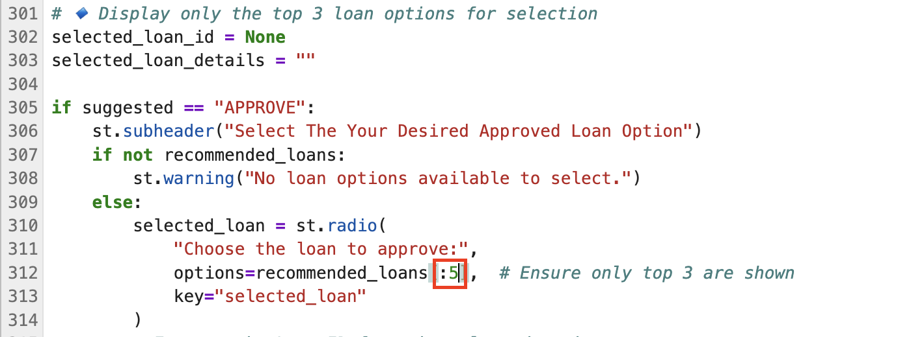
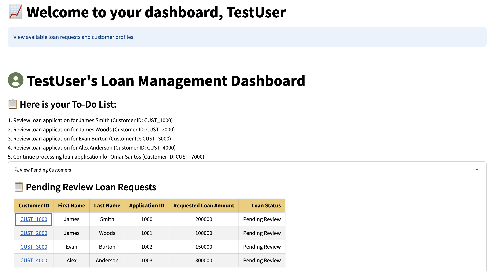

# Code with Generative AI step-by-step

## Introduction

In this lab, we’ll provide a step-by-step guide to help you successfully complete the coding challenge from the previous lab. This step-by-step guide will walk you through the necessary updates, providing solutions and insights to help you fully understand how to utilize AI Vector Search in a practical scenario. Whether you're refining your existing work or tackling the challenge for the first time, this guide will ensure you gain the skills and confidence needed to implement these powerful features.

Let’s dive in and unlock the full potential of AI Vector Search in your application!

Estimated Time: 30 minutes

### Objectives

In this lab, you will:
* Enhance your understanding of AI Vector Search by applying it to a real-world developer coding challenge.
* Gain hands-on experience with integrating AI Vector Search and refining application features to meet specific development requirements.

### Prerequisites

This lab assumes you have:
* An Oracle Cloud account
* Successfully completed Lab 1: Run the Demo
* Successfully completed Lab 3: Connect to Development Environment

## Task 1: Challenge Requirements 
The company has requested an enhancement to the current loan recommendation system. The loan officer has indicated that the existing 3 loan options are insufficient, and they'd like to see the top 5 loan options instead.

1. Update the Customers.py and Decision.py files to make the necessary changes in the code so that the AI prompt returns the top 5 loans instead of the current 3.

2. Ensure the output displays the top 5 loans like the image below:

    

## Task 2: Modify the Cutomers.py File

1. Click **Pages**.

    

2. Select the **Customers.py** file.

    

3. On lines 477 and 478, change the value 3 to **5**, as we need to display the top 5 loan recommendations instead of 3.

    

4. Save the Customers.py file.

    

## Task 3: Modify the Decision.py File

1. Select the **Decision.py** file.

    

2. On line 283, change the value 3 to **5**.

    

3. On line 297, change the value 3 to **5**.

    

4. On line 312, change the value 3 to **5**.

    

5. Save the Decision.py file.

    

## Task 4: Launch the Application

1. Select the **Launcher** tab and open the **terminal**

    

2. Copy the ./run.sh command and paste it into the terminal.

    ````bash
        $<copy>
        ./run.sh
        </copy>
    ````

3. Click the URL displayed in the terminal to launch the SeerEquities Loan Management application.

    

4. Enter in a username and click **Login**.

    

## Task 5: View the Results

1. On the Dashboard page, from the pending review list, select the Customer ID for **James Smith**.

    

2. This will display the customers loan application details. In approximately 15 seconds, the 5 AI generated loan recommendations will be displayed.

    

**Congratulations, you have successfully completed the Generative AI Challenge!** You have updated the files to make the necessary changes in the code so that the AI prompt returns the top 5 loans instead of the current 3. The company can now see more loans options and provide better service to their customer.


## Learn More

* [Oracle Database 23ai Documentation](https://docs.oracle.com/en/database/oracle/oracle-database/23/)

## Acknowledgements
* **Authors** - Linda Foinding, Francis Regalado
* **Contributors** - Kamryn Vinson, Eddie Ambler, Kevin Lazarz
* **Last Updated By/Date** - Kamryn Vinson, April 2025
